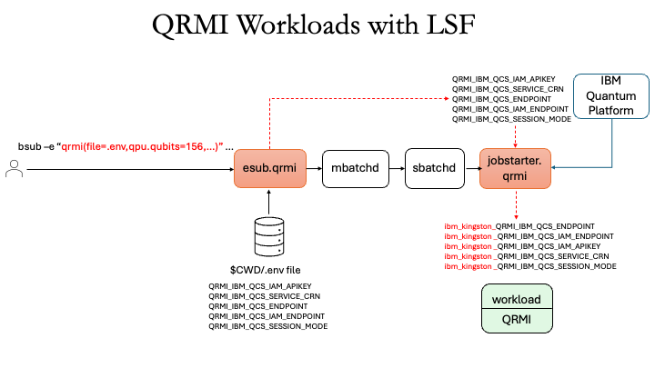

# Quantum workloads with IBM LSF

## Introduction
One of the key elements of the  paradigm is a unified management of workloads and workflows on the integrated
quantum computing and high performace compting infrastrtucture. The latter requires development of the corresponding middleware stack, which includes workload and workflow managers.

This repository contains implementation of plugins for IBM LSF workload manager for handling jobs using , a vendor agnostic library providing a set of APIs to facilitate deployment of workloads on quantum processing units (QPUs).

## Overview
Figure 1 depicts workflow of an LSF job submission using `esub.qrmi` and `jobstarter.qrmi`. 

 


## Prerequisites
- Working [IBM Spectrum LSF Suites](https://www.ibm.com/products/hpc-workload-management)  or [LSF Community Edition](https://epwt-www.mybluemix.net/software/support/trial/cst/programwebsite.wss?siteId=680&h=null&p=null) cluster.
- Account on  with generated API key and a CRN number.

## Deploying esub and jobstarter
Follow these steps as _root_.

1. Install dependencies, assuming that Python 3.11 (or later) is already available.

For example, on Rocky Linux 9.x:
```
dnf install python3.11-pip
pip-3 install requests dotenv omegaconf 
```

2. Add `esub.qrmi and jobstarter.qrmi` to the existing LSF cluster. 
```
git clone git@github.com:IBM/lsf-quantum.git
cd lsf-quantum
cp qrmi-esub-jobstarter.py $LSF_SERVERDIR
chmod a+xr $LSF_SERVERDIR/qrmi-esub-jobstarter.py
ln -s $LSF_SERVERDIR/qrmi-esub-jobstarter.py $LSF_SERVERDIR/esub.qrmi
ln -s $LSF_SERVERDIR/qrmi-esub-jobstarter.py $LSF_SERVERDIR/jobstarter.qrmi
```
Add jobstarter to `$LSF_ENVDIR/lsbatch/<cluster_name>/configdir/lsb.queues:
```
JOB_STARTER = /opt/lsf/10.1/linux3.10-glibc2.17-x86_64/etc/jobstarter.qrmi
```

## Using esub.qrmi

### Configuring user environment
Create a virtual environment, for example
```
conda create -n lsfqrmi python==3.11
conda activate lsfqrmi
pip install qrmi dotenv omegaconf requests
```
### Submitting jobs
```
Usage:
  esub.qrmi arguments
  esub.qrmi -h | --help

Arguments syntax:
            file=<filename>,
            device=<device_name>|qpu.<attribute>=<value>,..,qpu.<attribute>=<value>,
            [selector=basic|health|priority]
    
Arguments description:
  file                       Path to REST API credentials
  device                     QPU name
  qpu.qubits                 Minimum number of qubits
  qpu.processor_type         Required processor family
  qpu.clops                  Minimum CLOPS value
  qpu.t1_median_us           T1 median on QPU
  qpu.t2_median_us           T2 median on QPU
  qpu.cz_error_median        Median CZ error on QPU  
  qpu.sx_error_median        Median SX error on QPU  
  qpu.readout_error_median   Median readout error on QPU 

Note: device and qpu arguments are mutually exclusive

``` 
Submission examples:
```
        bsub -a "qrmi(file=.env, qpu.qubits=120,qpu.processor_type=Nighthawk)" my_quantum_app
        bsub -a "qrmi(file=.env, device=ibm_marrakesh)" my_quantum_app
        bsub -a "qrmi(file=.env, qpu.qubits=120,selector=priority)" my_quantum_app
```
For debugging:
```
      export LSF_ESUB_QRMI_DEBUG=level1 enables debugging messages
      export LSF_ESUB_QRMI_DEBUG=level2 enables level1 and more 
```
Before submitting any jobs to the IBM Quantum Platform prepare an file with template QRMI variables in your $CWD. Refer to  on how to cerate API key and CRN.
```
$ cat .env
QRMI_IBM_QCS_IAM_APIKEY=<user_api_key>
QRMI_IBM_QCS_SERVICE_CRN=<user_crn>
QRMI_IBM_QCS_ENDPOINT="https://quantum.cloud.ibm.com/api/v1"
QRMI_IBM_QCS_IAM_ENDPOINT="https://iam.cloud.ibm.com"
QRMI_IBM_QCS_SESSION_MODE="batch"
```
**Note: esub.qrm expects a short file name for QRMI templates and assumes that it is in $CWD.**

To verify your setup submit an interactive job asking for some qbits, for example
```
bsub -Is -a "qrmi(".env", 128)" /bin/bash
```
Once the job is dispatched check for QRMI environment variables, for example
```
$ env |grep QRMI
ibm_kingston_QRMI_IBM_QCS_IAM_APIKEY=<user_api_key>
ibm_kingston_QRMI_IBM_QCS_SERVICE_CRN=<user_crn>
ibm_kingston_QRMI_IBM_QCS_ENDPOINT=https://quantum.cloud.ibm.com/api/v1
ibm_kingston_QRMI_IBM_QCS_SESSION_MODE=batch
ibm_kingston_QRMI_IBM_QCS_IAM_ENDPOINT=https://iam.cloud.ibm.com
QRMI_IBM_QRS_BEST_DEVICE=ibm_kingston
```
**Note: QRMI_IBM_QRS_BEST_DEVICE is not usedby QRMI and is provided for conveniency.**

### Quantum Device Selection
User can choose different quantum device selection policy.  For example, 
```
bsub -Is -a "qrmi(file=".env",qpu.qbits=128)" run_example.sh
```
uses _basic_ selector, which chooses the least busy quantum device with at least 128 qubits.

```
bsub -Is -a "qrmi(file=".env",qpu.qubits=128,selector=health)" run_example.sh
```
uses _health_ selector, which chooses a quantum device based on a composite health score using _T1_, _readout error_ and _queue depth_ attributes of each available device. 

Here is the example of the health-based device selection:
```
[DEBUG] Device selection policy: health
[DEBUG] Device ibm_pittsburgh: qubits=156 T1=0.0µs err=1.0000 queue=679 → score=0.0000
[DEBUG] Device ibm_boston: qubits=156 T1=0.0µs err=1.0000 queue=124 → score=0.0000
[DEBUG] Device ibm_fez: qubits=156 T1=0.0µs err=1.0000 queue=435 → score=0.0000
[DEBUG] Skipping ibm_miami: only 120 qubits < 128 required
[DEBUG] Device ibm_marrakesh: qubits=156 T1=0.0µs err=1.0000 queue=3 → score=0.0000
[DEBUG] Device ibm_kingston: qubits=156 T1=0.0µs err=1.0000 queue=475 → score=0.0000
[DEBUG] Selected ibm_pittsburgh with health score 0.0000
[DEBUG] Best device:  ibm_pittsburgh
```

```
bsub -Is -a "qrmi(file=".env",qpu.qubits=128,selector=priority)" run_example.sh
```
uses _priority_ selector, which chooses a quantum device using the following algorithm:

        1. Start with every available backend.
        2. Process requirements in their string order.
        3. Remove backends that do not satisfy the current requirement.
        4. Among satisfying backends, retain those tied at the best value.
        5. Continue with the next requirement.
        6. If multiple backends remain, select by backend name.


Alternatively, if you want to use a particular quantum device:
```
bsub -Is -a "qrmi(file=".env", device=ibm_sherbrook)" run_example.sh
```
**Note: when device name is explicitly asked for, it is taken at face value and no checks for the device availability are made.**

## LSF ELIM for IBM Quantum Platform

This **LSF ELIM (External Load Information Manager)** to report available IBM Quantum systems (QPUS), their respective properties, as well as pending workloads as **load indices** in IBM Spectrum LSF. These indices, can help LSF to make better job placement and throttling decisions for workloads that target QPUs. It relies upon the IBM Qiskit REST API to retrieve information. 

## Overview

IBM Spectrum LSF uses **LIM (Load Information Manager)** to collect host metrics. **ELIM** is a plugin/executable that LIM invokes to fetch **custom load indices**. 
This ELIM is used to query the IBM Quantum Platform for information on QPUs including queue length and health, and provides this information to LSF for scheduling decisions. 

| Metric    | Description |
| -------- | ------- |
| qubits  | Number of qubits on QPU    |
| qpu_version  | QPU version    |
| processor_type  | QPU processor type    |
| clops  | QPU hardware-aware circuit layer operations per second    |
| pending_jobs | Pending jobs on QPU     |
| readout_error_median    | Median readout error on QPU    |
| sx_error_median    | Median SX error on QPU    |
| cz_error_median   | Median CZ error on QPU    |
| T1_median_us   | T1 median on QPU    |
| T2_median_us   | T2 median on QPU    |

## Details

- LIM periodically executes the ELIM script.
- ELIM authenticates to IBM Quantum (via API key) and queries backend status and queue metrics.
- ELIM prints `name=value` pairs to **stdout**, which LIM ingests as LSF load indices.

## Prerequisites

- **IBM Spectrum LSF** installed and configured on your cluster nodes (LIM must be running on the hosts where ELIM will execute).
- **IBM Quantum account** with an **API key** and access to desired backends.
- Network egress from the LIM/ELIM host(s) to the IBM Quantum API endpoint.
- Python 3.9+ and **Qiskit** installed. 

## Configuration

- *$LSF_ENVDIR/env.qpu* containing the IBM Quantum API key and CRN (Cloud Resource Name) required for authentication. The script *env.qpu* must be owned by the LSF Administrator user with octal 400 permissions. 

```bash
APIKEY=api_key_value
CRN=crn_value
```

- *$LSF_ENVDIR/lsf.shared* file updated to contain the following resources. IBM QPU names are defined as booleans to map a classical LSF server to a QPU and determine on which LSF host an elim will start and which QPU it will use to collect information. The list of QPUs available to the specific user can be obtained from the IBM Quantum Platform dashboard. 

```bash
Begin Resource
RESOURCENAME  TYPE    INTERVAL INCREASING  DESCRIPTION        # Keywords
...
...
ibm_marrakesh Boolean  ()       ()         (IBM QPU name)
ibm_fez       Boolean  ()       ()         (IBM QPU name)
ibm_torino    Boolean  ()       ()         (IBM QPU name)
qubits        Numeric  15       Y          (number of qubits)
clops         Numeric  15       Y          (QPU hardware-aware circuit layer operations per second)
qpu_version   String   15       ()         (QPU version)
processor_type String  15       ()         (QPU processor type)
pending_jobs Numeric   15       Y          (Pending jobs on QPU)
readout_error_median Numeric 15       Y    (readout error on QPU)
sx_error_median      Numeric 15       Y    (sx error median on QPU)
cz_error_median      Numeric 15       Y    (cz error median on QPU)
T1_median_µs         Numeric 15       Y    (T1 median on QPU)
T2_median_µs         Numeric 15       Y    (T2 on QPU)
...
...
End Resource
```

- *$LSF_ENVDIR/lsf.cluster.<cluster_name>* file with the Host and Resource Map sections as per the example here. In this example, the QPU ibm_fez is associated with the LSF manager lsf-manager-002. elim.qpu will be started on host lsf-manager-002 and query the QPU ibm_fez for details. 

```bash
Begin   Host
HOSTNAME  model    type        server  RESOURCES    #Keywords
lsf-manager-002 ! ! 1 (mg docker ibm_fez)
lsf-manager-001 ! ! 1 (mg)
....
....
End     Host
```

The dynamic resources defined in *lsf.shared* are configured in the Resource Map

```bash
Begin ResourceMap
RESOURCENAME  LOCATION
qubits                  [default]
clops                   [default]
qpu_version             [default]
processor_type          [default]
pending_jobs            [default]
readout_error_median    [default]
sx_error_median         [default]
cz_error_median         [default]
T1_median_µs            [default]
T2_median_µs            [default]
....
....
End ResourceMap
```

Before running LSF Elim, you need to map the classical system to the quantum system where the Elim will operate. This mapping allows the Elim to gather information about the target quantum system accurately.


## Install
<ol>
<li>Install the required packages on the host where the elim will be run. This corresponds to the LSF classical and QPU mapping that is defined in the LSF configuration. </li>

```bash
$ pip install qiskit requests
```

<li>As the LSF Administrator user, copy elim.qpu to correct directory and set the execute permissions.</li>

```bash
cp elim.qpu $LSF_SERVERDIR 
chmod 755 $LSF_SERVERDIR/elim.qpu
```

<li>Create the env.qpu file containing the CRN and API key. This information may be obtained from the IBM Quantum Platform dashboard for a given user account. Note that this information is essential to enable the correct operation of elim.qpu. Note that this assumes that host on which elim.qpu is executing has access to the IBM Quantum Platform. The file should be owned by the LSF Administrator user with permissions octal 400.</li>

```bash
$LSF_ENVDIR/env.qpu

APIKEY={api_key_value}
CRN={crn_value}
```

<li>Test the correct operation of the elim.</li>

```bash
$ $LSF_SERVERDIR/elim.qpu
10 qubits 156 clops 320000 qpu_version 1.3.29 processor_type Heron_r2 pending_jobs 59 readout_error_median 0.0093994140625 sx_error_median 0.0002728404301144044 cz_error_median 0.0026482947745996577 T1_median_µs 141.29 T2_median_µs 101.06 
10 qubits 156 clops 320000 qpu_version 1.3.29 processor_type Heron_r2 pending_jobs 57 readout_error_median 0.0093994140625 sx_error_median 0.0002728404301144044 cz_error_median 0.0026482947745996577 T1_median_µs 141.29 T2_median_µs 101.06 
10 qubits 156 clops 320000 qpu_version 1.3.29 processor_type Heron_r2 pending_jobs 57 readout_error_median 0.0093994140625 sx_error_median 0.0002728404301144044 cz_error_median 0.0026482947745996577 T1_median_µs 141.29 T2_median_µs 101.06 
....
....
```

<li>Put the elim into operation by reconfiguring LSF.</li>

```bash
lsadmin reconfig
badmin reconfig
```

<li>Verify the correct operation of the elim. In this case, the elim is configured to exit on startup if it is executed on an LSF host for which there is no mapping defined. Here we look at host lsf-manager-002 which has been mapped to QPU *ibm_fez*.</li>

```bash
$ lsinfo |grep ibm_fez
ibm_fez       Boolean   N/A   IBM QPU name
```

```bash
$ lsinfo |grep QPU
clops         Numeric   Inc   QPU hardware-aware circuit layer operations per second
pending_jobs  Numeric   Inc   Pendings jobs on QPU
readout_error Numeric   Inc   readout error on QPU
sx_error_medi Numeric   Inc   sx error median on QPU
cz_error_medi Numeric   Inc   cz error median on QPU
T1_median_µs Numeric   Inc   T1 median on QPU
T2_median_µs Numeric   Inc   T2 on QPU
ibm_marrakesh Boolean   N/A   IBM QPU name
ibm_fez       Boolean   N/A   IBM QPU name
ibm_torino    Boolean   N/A   IBM QPU name
qpu_version    String   N/A   QPU version
processor_type  String   N/A   QPU processor type
```

```bash
$ lshosts -w lsf-manager-002
HOST_NAME                       type       model  cpuf ncpus maxmem maxswp server RESOURCES
lsf-manager-002                 X86_64    Intel_E5  12.5    16  62.3G      -    Yes (docker mg ibm_fez)
```
```bash
$ lsload -l lsf-manager-002
HOST_NAME               status  r15s   r1m  r15m   ut    pg    io  ls    it   tmp   swp   mem  ngpus ngpus_physical qubits  clops pending_jobs readout_error_median sx_error_median cz_error_median T1_median_µs T2_median_µs  qpu_version  processor_type
lsf-manager-002         ok   0.5   0.4   0.2   1%   0.0    53   1     0   69G    0M 48.1G    0.0            0.0  156.0   3e+5         28.0                  0.0             0.0             0.0         141.3         101.1       1.3.29        Heron_r2
```

## Scheduling Examples

Use the indices in resource requirements at job submission time: 

```bash
# Select QPU with less than 100 pending jobs in queue
bsub -R "select[pending_jobs < 100]" job3_quantum.py

# Select QPU with the lowest median readout error
bsub -R "order[readout_error_median]" test_circuit.py
```

---
### How to Cite This Work
_Vadim Elisseev, Vassilis Kalantzis, Gábor Samu, Ritesh Krishna, Practical Example of Resources-Aware Scheduling of Hybrid Quantum-Classical Workflows, to appear in IEEE QCE26 Proceedings._

### Contribution Guidelines
For information on how to contribute to this project, please take a look at our [contribution guidelines](CONTRIBUTING.md).

---
## References and Acknowledgements
1. Quantum Resource Management Interface (QRMI): https://github.com/qiskit-community/qrmi/tree/main
2. Qiskit https://www.ibm.com/quantum/qiskit
3. IBM Quantum https://www.ibm.com/quantum
5. STFC The Hartree Centre, https://www.hartree.stfc.ac.uk. This work was supported by the Hartree National Centre for Digital Innovation (HNCDI) programme.
